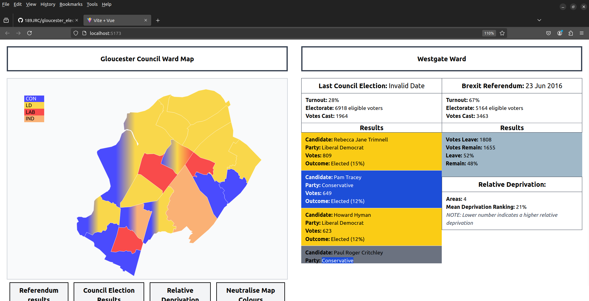
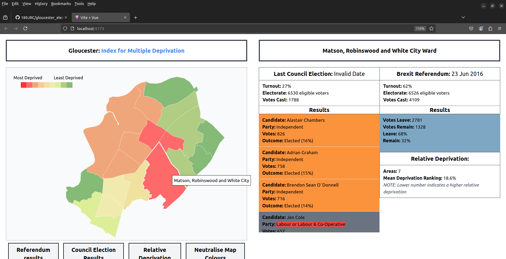
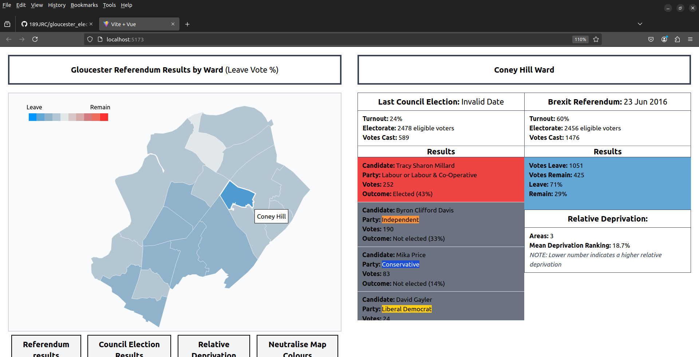

### Electoral Data Visualisation

#### Purpose: Reveal Electoral Insights for political strategists

Web application for visualising UK electoral data from open source resources.

#### Main Components

- web scraper - data capture from internet resources
- data pipeline - extract, transform and load data with pyspark
- sqlite database - normalise data for storage and archiving
- flask - lightweight backend for data retrieval
- vue - reactive frontend for user navigation
- D3 - data driven designs used for graphical data visualisations

#### Project to Date

- PoC completed: Map visualisations created for Gloucester constituency, including:
- Most recent council election results 
- Brexit referendum results
- Indices for Multiple Deprivation adjusted for council wards

#### WIP

- Strengthen and scale data pipeline
- Capture data for multiple constituencies
- Manage data storage using pyspark (raw web scrape > dataframes > SQL tables)
- Design database tables
- Build SQL views/indexing for speedier retrieval
- Normalise database to eliminate redundancy
- Manage data retrieval with pyspark - transform sql data into json for D3
