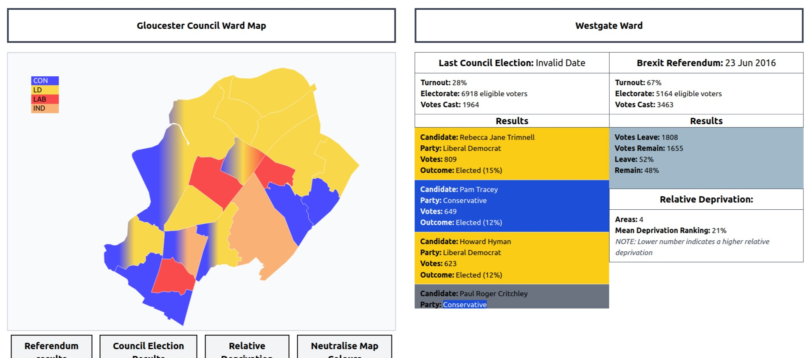
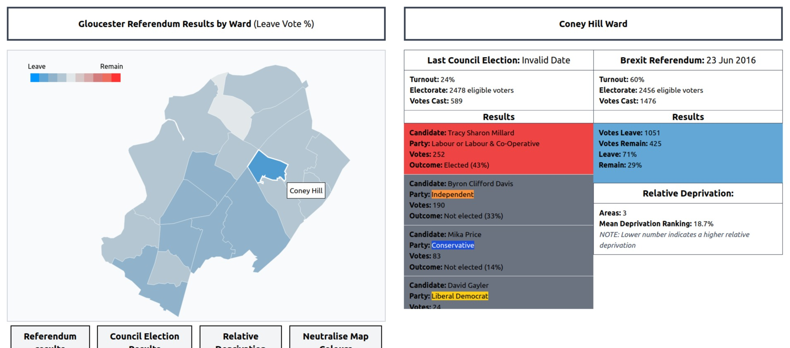
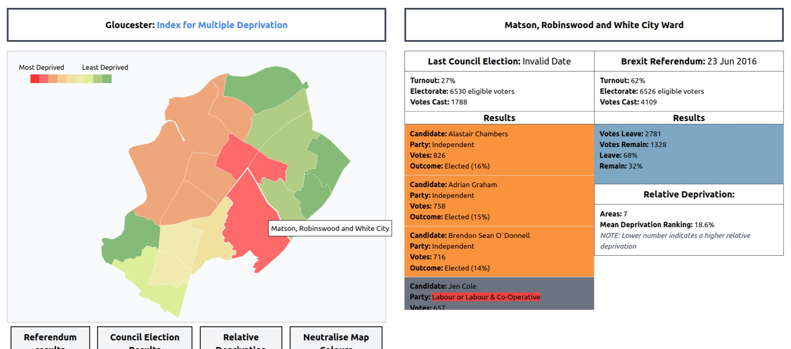

### Electoral Data Visualisation

#### Purpose: Reveal Electoral Insights for political strategists

Web application for visualising UK electoral data from open source resources.

#### Data Privacy Statement

> This application uses publicly available information sourced exclusively from UK council websites. This includes names and other details that are made openly accessible by these councils. This application does not collect, store, or process sensitive personal data beyond what is publicly provided.
>
> I am committed to handling this information responsibly and in compliance with the UK GDPR and the Data Protection Act 2018. If you have concerns about your information being used, please contact me at cjas@tuta.io. I will review and, if necessary, remove the information promptly.
>
> The sole purpose of this application is to provide electoral data in a visually impactful manner and does not involve altering, misrepresenting, or misusing any publicly available data.==

#### Main Components

- web scraper - data capture from internet resources
- data pipeline - extract, transform and load data with pyspark
- sqlite database - normalise data for storage and archiving
- flask - lightweight backend for data retrieval
- vue - reactive frontend for user navigation
- D3 - data driven designs used for graphical data visualisations

#### Project to Date

- PoC completed: Map visualisations created for Gloucester constituency, including:
- Most recent council election results 
- Brexit referendum results
- Indices for Multiple Deprivation adjusted for council wards

#### WIP

- Strengthen and scale data pipeline
- Capture data for multiple constituencies
- Manage data storage using pyspark (raw web scrape > dataframes > SQL tables)
- Design database tables
- Build SQL views/indexing for speedier retrieval
- Normalise database to eliminate redundancy
- Manage data retrieval with pyspark - transform sql data into json for D3
